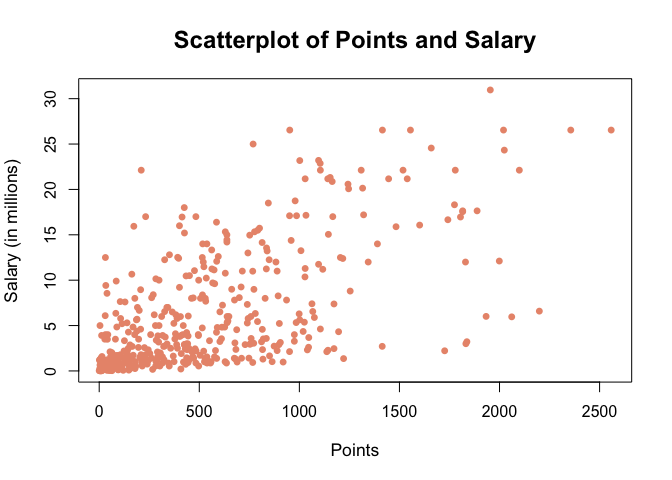
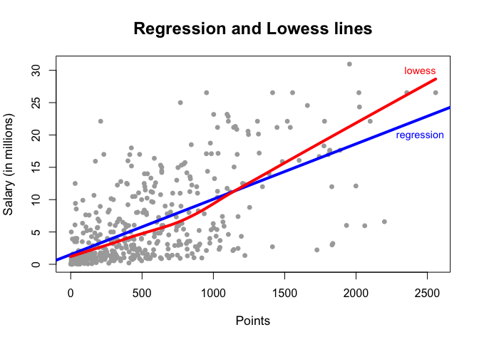
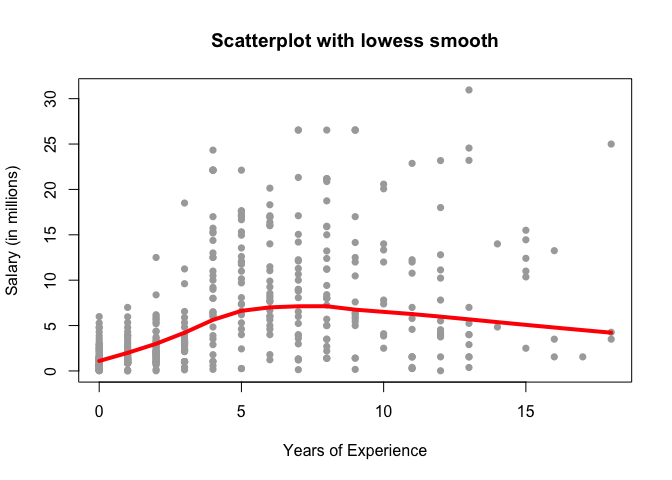
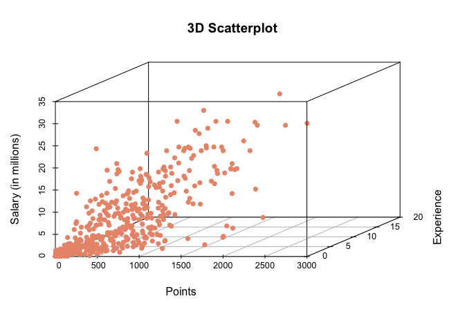
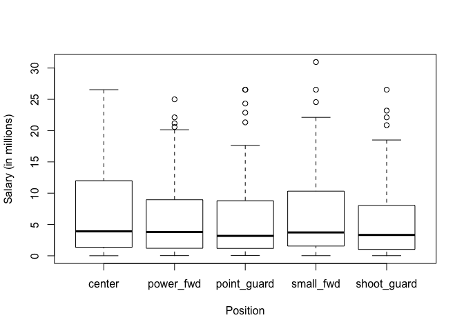

HW 01 - More Vectors
================
Vitali Shypko
9/22/2017

#### Importing the data

``` r
# load data file
load("data/nba2017-salary-points.RData")
```

``` r
# list the available objects
ls()
```

    ## [1] "experience" "player"     "points"     "points1"    "points2"   
    ## [6] "points3"    "position"   "salary"     "team"

------------------------------------------------------------------------

### 1) A bit of data preprocessing

``` r
# salary in millions
salary_millions <- as.numeric(formatC((salary / 1000000), digits = 2, format = "f"))
```

``` r
# experience as integer vector (replacing "R" with 0)
experience <- as.integer(replace(experience, experience=="R", 0))
```

``` r
# more desctiptive names for positions in new position factor
position = factor(position, labels=c("center", "power_fwd", "point_guard", "small_fwd", "shoot_guard"))
```

The frequencies with the function table():

``` r
table(position)
```

    ## position
    ##      center   power_fwd point_guard   small_fwd shoot_guard 
    ##          89          89          85          83          95

------------------------------------------------------------------------

### 2) Scatterplot of Points and Salary

``` r
plot(points, salary_millions, pch=16, col = "darksalmon", cex = 0.95, cex.lab = 1.1, cex.main = 1.5, 
     xlab = "Points", ylab = "Salary (in millions)", main = "Scatterplot of Points and Salary")
```



From the scatterplot it is evident that the vast majority of players earn less than 5 million dollars a year. Some of those players score more than players who earn 20+ millions, so it is safe to say that there is not direct correlation between points scored and salary. It means that there are other factors that play a major role in how much a player earns besides points scored.

------------------------------------------------------------------------

### 3) Correlation between Points and Salary

``` r
X = points
Y = salary_millions
```

``` r
n = length(player)
```

Number of individuals: *441*

``` r
x = 1 / n * sum(X)
```

Mean of variable X (points): *546.61*

``` r
y = 1 / n * sum(Y)
```

Mean of variable Y (salary in millions): *6.19*

``` r
varX = 1 / (n - 1) * sum((X - x)^2)
```

Variance of X: *239136.24*

``` r
varY = 1 / (n - 1) * sum((Y - y)^2)
```

Variance of Y: *43.20*

``` r
sdX = sqrt(varX)
```

Standard deviation of X: *489.02*

``` r
sdY = sqrt(varY)
```

Standard deviation of Y: *6.57*

``` r
covXY = 1 / (n - 1) * sum((X - x) * (Y - y))
```

Covariance between X and Y: *2046.43*

``` r
corXY = covXY / (sdX * sdY)
```

Correlation between X and Y: *0.64*

------------------------------------------------------------------------

### 4) Simple Linear Regression

``` r
b1 = corXY * (sdY / sdX)
```

Estimated slope of the regression line: *0.0086*

``` r
b0 = y - b1 * x
```

Estimated intercept of the regression line: *1.5091*

``` r
Yhat = b0 + b1 * X
```

Summary statistics:

``` r
summary(Yhat)
```

    ##    Min. 1st Qu.  Median    Mean 3rd Qu.    Max. 
    ##   1.509   2.844   5.206   6.187   8.184  23.399

The regression equation *Y*^=*b*<sub>0</sub> + *b*<sub>1</sub>*X* is a statistical technique used to explain or predict the behavior of a dependent variable.

The slope coefficient *b*<sub>1</sub> is the rate of change in Y as X changes (steepness of a line).

The intercept term *b*<sub>0</sub> is the expected mean value of Y when all X = 0 (indicates the location where the line intersects an axis).

``` r
Yhat = b0 + b1 * 0
```

Predicted salary (in millions) for a player who scores 0 points: *1.51*

``` r
Yhat = b0 + b1 * 100
```

Predicted salary (in millions) for a player who scores 100 points: *2.36*

``` r
Yhat = b0 + b1 * 500
```

Predicted salary (in millions) for a player who scores 500 points: *5.79*

``` r
Yhat = b0 + b1 * 1000
```

Predicted salary (in millions) for a player who scores 1000 points: *10.07*

``` r
Yhat = b0 + b1 * 2000
```

Predicted salary (in millions) for a player who scores 2000 points: *18.62*

------------------------------------------------------------------------

### 5) Plotting the regression line

``` r
plot(points, salary_millions, pch=16, col = "darkgray", cex = 0.95, cex.lab = 1.1, cex.main = 1.5,
     xlab = "Points", ylab = "Salary (in millions)", main = "Regression and Lowess lines")

abline(reg = lm(salary_millions ~ points), lwd = "4", col = "blue")
lines(lowess(points, salary_millions), lwd = "4", col = "red")

text(2450, 20, "regression", col = "blue", cex = 0.9)
text(2450, 30, "lowess", col = "red", cex = 0.9)
```



------------------------------------------------------------------------

### 6) Regression residuals and Coefficient of Determination *R*<sup>2</sup>

``` r
# vector of residuals
e = Y - Yhat
```

The vector of residuals summary:

``` r
summary(e)
```

    ##    Min. 1st Qu.  Median    Mean 3rd Qu.    Max. 
    ## -18.614 -17.334 -15.124 -12.438  -9.374  12.336

``` r
RSS = sum((e)^2)
```

The Residual Sum of Squares: *87225.28*

``` r
TSS = sum((Y - y)^2)
```

The Total Sum of Squares: *19005.80*

``` r
Rsquared = 1 - (RSS / TSS)
```

The coefficient of determination *R*<sup>2</sup>: *-3.59*

------------------------------------------------------------------------

### 7) Exploring Position and Experience

``` r
plot(experience, salary_millions, pch=16, col = "darkgray", xlab = "Years of Experience",
     ylab = "Salary (in millions)", main = "Scatterplot with lowess smooth")
lines(lowess(experience, salary_millions), lwd = "4", col = "red")
```



From this scatterplot with lowess smooth, we see that Experience seems to be related with Salary. There is an obvious up trend from 0 to 5-6 years of experience that slows down gradually after that and eventually declines slowly. This makes sense because rookies are very young and new, they have a lot to learn and need more practice before they can become stronger players. As they gradually become better, their salary goes up until they hit their peak form. After that, they start to become older and eventually cannot handle physical exercise as well as they used to. Therefore, they get paid less.

``` r
# install.packages("scatterplot3d") (used for one-time installation of the package)
library("scatterplot3d")
scatterplot3d(points, experience, salary_millions, pch = 16, color = "darksalmon", xlab = "Points",
              ylab = "Experience", zlab = "Salary (in millions)", main = "3D Scatterplot")
```



From this 3D scatterplot it is rather challenging to say for sure if there is correlation between Experience and Salary. It would be more evident if we could turn the scatterplot however we like.

``` r
boxplot(salary_millions ~ position,  xlab = "Position", ylab = "Salary (in millions)")
```



From this scatterplot there is no real dependence between positions and salaries. Center players tend to make a bit more money on average and their salaries are the most spread out.

------------------------------------------------------------------------

### 8) Comments and Reflections

-   What things were hard, even though you saw them in class?

> I already saw boxplot in the class, but it was hard to interpret it with given data. I was not sure if the bars represent average values and what exactly is the meaning of things displayed above the bars.

-   What was easy(-ish) even though we haven’t done it in class?

> Installing and using scatterplot3d package was rather easy even though it was the first time I have interacted with it.

-   If this was the first time you were using git, how do you feel about it?

> This is not the first time I'm using git, so I feel pretty good about git in general. It's a very useful tool.

-   If this was the first time using GitHub, how do you feel about it?

> This is not the first time I was using GitHub and I feel good about using it in this class.

-   Did you need help to complete the assignment? If so, what kind of help? Who helped you?

> I had to look for some functions and their usage online. Also, I had to download and install a separate library for scatterplot3d. Moreover, I attended office hours because I had questions about overall composition of the homework and my abline function did not quite work. Turns out, that was because I passed salary instead of salary\_millions there.

-   How much time did it take to complete this HW?

> It took me about 6-8 hours to complete this homework.

-   What was the most time consuming part?

> Figuring out how to build plots and interpret them took a lot of time. Also, there were some concepts and formulas that were new to me since I am not a Statistics major.

-   Was there anything that you did not understand? or fully grasped?

> I did not fully get the meaning behind Regression residuals and sums of squares.

-   Was there anything frustrating in particular?

> Finding an uppercase Y-hat symbol for the inline formula was particularly frustrating.

-   Was there anything exciting? Something that you feel proud of? (Don’t be shy, we won’t tell anyone).

> The most exciting part for me was building a 3d graph. It seems like a great way to visualize data.
