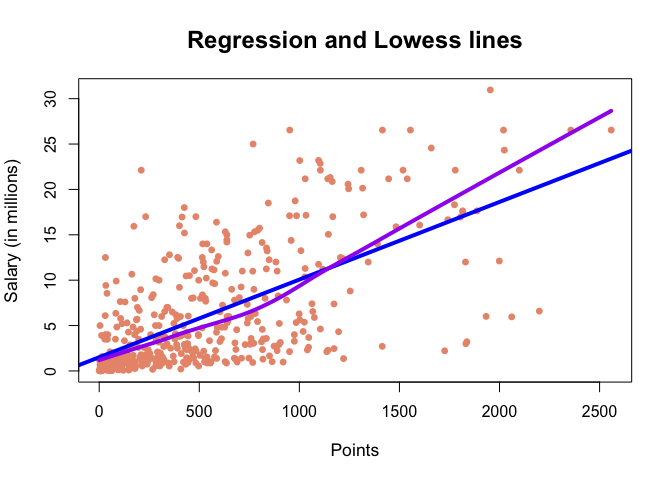

HW1
================
Vitali Shypko
9/19/2017

``` r
# load data file
load("data/nba2017-salary-points.RData")
```

``` r
# list the available objects
ls()
```

    ## [1] "experience" "player"     "points"     "points1"    "points2"   
    ## [6] "points3"    "position"   "salary"     "team"

1) A bit of data preprocessing
------------------------------

``` r
salary_millions <- formatC((salary / 1000000), digits = 2, format = "f")
```

``` r
experience <- as.integer(replace(experience, experience=="R", 0))
```

``` r
position = factor(position, labels=c("center","power_fwd","point_guard", "small_fwd", "shoot_guard"))
table(position)
```

    ## position
    ##      center   power_fwd point_guard   small_fwd shoot_guard 
    ##          89          89          85          83          95

2) Scatterplot of Points and Salary
-----------------------------------

``` r
plot(points, salary_millions, pch=16, col = "darksalmon", cex = 0.95, cex.lab = 1.1, cex.main = 1.5, xlab = "Points", ylab = "Salary (in millions)", main = "Scatterplot of Points and Salary")
```


3) Correlation between Points and Salary
----------------------------------------

``` r
X = points
Y = salary

n = length(player)
cat("Number of individuals:", n)
```

    ## Number of individuals: 441

``` r
x = 1 / n * sum(X)
cat("Mean of variable X (points):", x)
```

    ## Mean of variable X (points): 546.6054

``` r
y = 1 / n * sum(Y)
cat("Mean of variable Y (salary):", y)
```

    ## Mean of variable Y (salary): 6187014

``` r
varX = 1 / (n - 1) * sum((X - x)^2)
cat("Variance of X:", varX)
```

    ## Variance of X: 239136.2

``` r
varY = 1 / (n - 1) * sum((Y - y)^2)
cat("Variance of Y:", varY)
```

    ## Variance of Y: 4.318973e+13

``` r
sdX = sqrt(varX)
cat("Standard deviation of X:", sdX)
```

    ## Standard deviation of X: 489.0156

``` r
sdY = sqrt(varY)
cat("Standard deviation of Y:", sdY)
```

    ## Standard deviation of Y: 6571890

``` r
covXY = 1 / (n - 1) * sum((X - x) * (Y - y))
cat("Covariance between X and Y:", covXY)
```

    ## Covariance between X and Y: 2046212512

``` r
corXY = covXY / (sdX * sdY)
cat("Correlation between X and Y:", corXY)
```

    ## Correlation between X and Y: 0.6367043

4) Simple Linear Regression
---------------------------

``` r
b1 = corXY * (sdY / sdX)
b0 = y - b1 * x
Yhat = b0 + b1 * X

summary(Yhat)
```

    ##     Min.  1st Qu.   Median     Mean  3rd Qu.     Max. 
    ##  1509886  2844728  5206372  6187014  8184097 23397875

The regression equation is *ŷ* = *b*<sub>0</sub> + *b*<sub>1</sub>*X*.

The slope coefficient *b*<sub>1</sub> is the rate of change of Y as X changes.

The intercept term *b*<sub>0</sub> is the expected mean value of Y when all X = 0.

``` r
Yhat = b0 + b1 * 0
cat("Predicted salary for a player who scores 0 points:", Yhat)
```

    ## Predicted salary for a player who scores 0 points: 1509886

``` r
Yhat = b0 + b1 * 100
cat("Predicted salary for a player who scores 100 points:", Yhat)
```

    ## Predicted salary for a player who scores 100 points: 2365554

``` r
Yhat = b0 + b1 * 500
cat("Predicted salary for a player who scores 500 points:", Yhat)
```

    ## Predicted salary for a player who scores 500 points: 5788226

``` r
Yhat = b0 + b1 * 1000
cat("Predicted salary for a player who scores 1000 points:", Yhat)
```

    ## Predicted salary for a player who scores 1000 points: 10066566

``` r
Yhat = b0 + b1 * 2000
cat("Predicted salary for a player who scores 2000 points:", Yhat)
```

    ## Predicted salary for a player who scores 2000 points: 18623247

5) Plotting the regression line
-------------------------------

``` r
plot(points, salary_millions, pch=16, col = "darksalmon", cex = 0.95, cex.lab = 1.1, cex.main = 1.5, xlab = "Points", ylab = "Salary (in millions)", main = "Scatterplot of Points and Salary")

abline(b0, b1, lwd = "4", col = "blue")

lines(lowess(points), lwd = "4", col = "purple")
lines(lowess(salary_millions), lwd = "4", col = "red")
```


6) Regression residuals and Coefficient of Determination *R*<sup>2</sup>
------------------------------------------------------------------------

``` r
e = Y - Yhat
summary(e)
```

    ##      Min.   1st Qu.    Median      Mean   3rd Qu.      Max. 
    ## -18618102 -17337087 -15123247 -12436233  -9373247  12340203

``` r
RSS = sum((e)^2)
TSS = sum((Y - y)^2)
Rsquared = 1 - (RSS / TSS)
```

7) Exploring Position and Experience
------------------------------------

``` r
plot(experience, salary_millions, xlab = "Years of Experience", ylab = "Salary (in millions)")
lines(lowess(experience), lwd = "4", col = "purple")
lines(lowess(salary_millions), lwd = "4", col = "red")
```



``` r
#install.packages("scatterplot3d")
library("scatterplot3d")
scatterplot3d(points, experience, salary_millions, xlab = "Points", ylab = "Salary (in millions)", zlab = "Experience")
```


``` r
#???boxplot(position)
```

-   Provide concise descriptions for the plots of this section.
-   From the scatterplots, does Experience seem to be related with Salary?
-   From the boxplot, does Position seem to be related with Salary?

8) Comments and Reflections
---------------------------

-   What things were hard, even though you saw them in class?

> Answer

-   What was easy(-ish) even though we haven’t done it in class?

> Answer

-   If this was the first time you were using git, how do you feel about it?

> This is not the first time I'm using git, so I feel pretty good about git in general. It's a great tool.

-   If this was the first time using GitHub, how do you feel about it?

> This is not the first time I'm using GitHub.

-   Did you need help to complete the assignment? If so, what kind of help? Who helped you?

> I had to look for some functions and their usage online. Also, I had to download and install a separate library for scatterplot3d.

-   How much time did it take to complete this HW?

> About 6-7 hours

-   What was the most time consuming part?

> Answer

-   Was there anything that you did not understand? or fully grasped?

> Answer

-   Was there anything frustrating in particular?

> Answer

-   Was there anything exciting? Something that you feel proud of? (Don’t be shy, we won’t tell anyone).

> The most exciting part for me was building a 3d graph. It seems like a very great way to visualize information.
