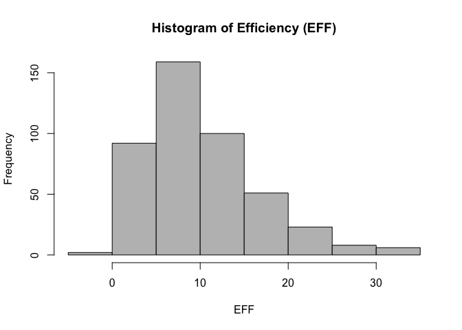
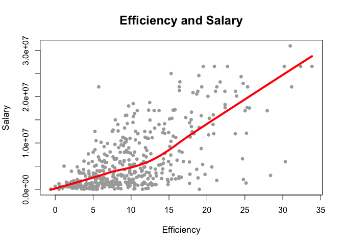

HW 02 - Basics of Data Frames
================
Vitali Shypko
9/25/2017

### Import the data in R

``` r
# import data using read.csv() with specified column types
colClass_csv = c("character", # Player
                 "character", # Team
                 "factor",    # Position
                 "character", # Experience
                 "double",    # Salary
                 "integer",   # Rank
                 "integer",   # Age
                 "integer",   # GP
                 "integer",   # GS
                 "integer",   # MIN
                 "integer",   # FGM
                 "integer",   # FGA
                 "integer",   # Points3               
                 "integer",   # Points3_atts
                 "integer",   # Points2
                 "integer",   # Points2_atts
                 "integer",   # FTM
                 "integer",   # FTA
                 "integer",   # OREB
                 "integer",   # DREB
                 "integer",   # AST
                 "integer",   # STL
                 "integer",   # BLK
                 "integer")   # TO

players_stat_base <- read.csv('data/nba2017-player-statistics.csv',
                              stringsAsFactors = FALSE,
                              colClasses = colClass_csv)
str(players_stat_base)
```

    ## 'data.frame':    441 obs. of  24 variables:
    ##  $ Player      : chr  "Al Horford" "Amir Johnson" "Avery Bradley" "Demetrius Jackson" ...
    ##  $ Team        : chr  "BOS" "BOS" "BOS" "BOS" ...
    ##  $ Position    : Factor w/ 5 levels "C","PF","PG",..: 1 2 5 3 4 3 4 5 4 2 ...
    ##  $ Experience  : chr  "9" "11" "6" "R" ...
    ##  $ Salary      : num  26540100 12000000 8269663 1450000 1410598 ...
    ##  $ Rank        : int  4 6 5 15 11 1 3 13 8 10 ...
    ##  $ Age         : int  30 29 26 22 31 27 26 21 20 29 ...
    ##  $ GP          : int  68 80 55 5 47 76 72 29 78 78 ...
    ##  $ GS          : int  68 77 55 0 0 76 72 0 20 6 ...
    ##  $ MIN         : int  2193 1608 1835 17 538 2569 2335 220 1341 1232 ...
    ##  $ FGM         : int  379 213 359 3 95 682 333 25 192 114 ...
    ##  $ FGA         : int  801 370 775 4 232 1473 720 58 423 262 ...
    ##  $ Points3     : int  86 27 108 1 39 245 157 12 46 45 ...
    ##  $ Points3_atts: int  242 66 277 1 111 646 394 35 135 130 ...
    ##  $ Points2     : int  293 186 251 2 56 437 176 13 146 69 ...
    ##  $ Points2_atts: int  559 304 498 3 121 827 326 23 288 132 ...
    ##  $ FTM         : int  108 67 68 3 33 590 176 6 85 26 ...
    ##  $ FTA         : int  135 100 93 6 41 649 217 9 124 37 ...
    ##  $ OREB        : int  95 117 65 2 17 43 48 6 45 60 ...
    ##  $ DREB        : int  369 248 269 2 68 162 367 20 175 213 ...
    ##  $ AST         : int  337 140 121 3 33 449 155 4 64 71 ...
    ##  $ STL         : int  52 52 68 0 9 70 72 10 35 26 ...
    ##  $ BLK         : int  87 62 11 0 7 13 23 2 18 17 ...
    ##  $ TO          : int  116 77 88 0 25 210 79 4 68 39 ...

``` r
# import data using readr's read_csv() with specified column types
library("readr")
players_stat_readr <- read_csv('data/nba2017-player-statistics.csv', 
                               col_types = cols(
                                 col_character(), # Player
                                 col_character(), # Team
                                 col_factor(c("C", "PF", "PG", "SF", "SG")),    # Position
                                 col_character(), # Experience
                                 col_double(),    # Salary
                                 col_integer(),   # Rank
                                 col_integer(),   # Age
                                 col_integer(),   # GP
                                 col_integer(),   # GS
                                 col_integer(),   # MIN
                                 col_integer(),   # FGM
                                 col_integer(),   # FGA
                                 col_integer(),   # Points3               
                                 col_integer(),   # Points3_atts
                                 col_integer(),   # Points2
                                 col_integer(),   # Points2_atts
                                 col_integer(),   # FTM
                                 col_integer(),   # FTA
                                 col_integer(),   # OREB
                                 col_integer(),   # DREB
                                 col_integer(),   # AST
                                 col_integer(),   # STL
                                 col_integer(),   # BLK
                                 col_integer()))
str(players_stat_readr)
```

    ## Classes 'tbl_df', 'tbl' and 'data.frame':    441 obs. of  24 variables:
    ##  $ Player      : chr  "Al Horford" "Amir Johnson" "Avery Bradley" "Demetrius Jackson" ...
    ##  $ Team        : chr  "BOS" "BOS" "BOS" "BOS" ...
    ##  $ Position    : Factor w/ 5 levels "C","PF","PG",..: 1 2 5 3 4 3 4 5 4 2 ...
    ##  $ Experience  : chr  "9" "11" "6" "R" ...
    ##  $ Salary      : num  26540100 12000000 8269663 1450000 1410598 ...
    ##  $ Rank        : int  4 6 5 15 11 1 3 13 8 10 ...
    ##  $ Age         : int  30 29 26 22 31 27 26 21 20 29 ...
    ##  $ GP          : int  68 80 55 5 47 76 72 29 78 78 ...
    ##  $ GS          : int  68 77 55 0 0 76 72 0 20 6 ...
    ##  $ MIN         : int  2193 1608 1835 17 538 2569 2335 220 1341 1232 ...
    ##  $ FGM         : int  379 213 359 3 95 682 333 25 192 114 ...
    ##  $ FGA         : int  801 370 775 4 232 1473 720 58 423 262 ...
    ##  $ Points3     : int  86 27 108 1 39 245 157 12 46 45 ...
    ##  $ Points3_atts: int  242 66 277 1 111 646 394 35 135 130 ...
    ##  $ Points2     : int  293 186 251 2 56 437 176 13 146 69 ...
    ##  $ Points2_atts: int  559 304 498 3 121 827 326 23 288 132 ...
    ##  $ FTM         : int  108 67 68 3 33 590 176 6 85 26 ...
    ##  $ FTA         : int  135 100 93 6 41 649 217 9 124 37 ...
    ##  $ OREB        : int  95 117 65 2 17 43 48 6 45 60 ...
    ##  $ DREB        : int  369 248 269 2 68 162 367 20 175 213 ...
    ##  $ AST         : int  337 140 121 3 33 449 155 4 64 71 ...
    ##  $ STL         : int  52 52 68 0 9 70 72 10 35 26 ...
    ##  $ BLK         : int  87 62 11 0 7 13 23 2 18 17 ...
    ##  $ TO          : int  116 77 88 0 25 210 79 4 68 39 ...
    ##  - attr(*, "spec")=List of 2
    ##   ..$ cols   :List of 24
    ##   .. ..$ Player      : list()
    ##   .. .. ..- attr(*, "class")= chr  "collector_character" "collector"
    ##   .. ..$ Team        : list()
    ##   .. .. ..- attr(*, "class")= chr  "collector_character" "collector"
    ##   .. ..$ Position    :List of 3
    ##   .. .. ..$ levels    : chr  "C" "PF" "PG" "SF" ...
    ##   .. .. ..$ ordered   : logi FALSE
    ##   .. .. ..$ include_na: logi FALSE
    ##   .. .. ..- attr(*, "class")= chr  "collector_factor" "collector"
    ##   .. ..$ Experience  : list()
    ##   .. .. ..- attr(*, "class")= chr  "collector_character" "collector"
    ##   .. ..$ Salary      : list()
    ##   .. .. ..- attr(*, "class")= chr  "collector_double" "collector"
    ##   .. ..$ Rank        : list()
    ##   .. .. ..- attr(*, "class")= chr  "collector_integer" "collector"
    ##   .. ..$ Age         : list()
    ##   .. .. ..- attr(*, "class")= chr  "collector_integer" "collector"
    ##   .. ..$ GP          : list()
    ##   .. .. ..- attr(*, "class")= chr  "collector_integer" "collector"
    ##   .. ..$ GS          : list()
    ##   .. .. ..- attr(*, "class")= chr  "collector_integer" "collector"
    ##   .. ..$ MIN         : list()
    ##   .. .. ..- attr(*, "class")= chr  "collector_integer" "collector"
    ##   .. ..$ FGM         : list()
    ##   .. .. ..- attr(*, "class")= chr  "collector_integer" "collector"
    ##   .. ..$ FGA         : list()
    ##   .. .. ..- attr(*, "class")= chr  "collector_integer" "collector"
    ##   .. ..$ Points3     : list()
    ##   .. .. ..- attr(*, "class")= chr  "collector_integer" "collector"
    ##   .. ..$ Points3_atts: list()
    ##   .. .. ..- attr(*, "class")= chr  "collector_integer" "collector"
    ##   .. ..$ Points2     : list()
    ##   .. .. ..- attr(*, "class")= chr  "collector_integer" "collector"
    ##   .. ..$ Points2_atts: list()
    ##   .. .. ..- attr(*, "class")= chr  "collector_integer" "collector"
    ##   .. ..$ FTM         : list()
    ##   .. .. ..- attr(*, "class")= chr  "collector_integer" "collector"
    ##   .. ..$ FTA         : list()
    ##   .. .. ..- attr(*, "class")= chr  "collector_integer" "collector"
    ##   .. ..$ OREB        : list()
    ##   .. .. ..- attr(*, "class")= chr  "collector_integer" "collector"
    ##   .. ..$ DREB        : list()
    ##   .. .. ..- attr(*, "class")= chr  "collector_integer" "collector"
    ##   .. ..$ AST         : list()
    ##   .. .. ..- attr(*, "class")= chr  "collector_integer" "collector"
    ##   .. ..$ STL         : list()
    ##   .. .. ..- attr(*, "class")= chr  "collector_integer" "collector"
    ##   .. ..$ BLK         : list()
    ##   .. .. ..- attr(*, "class")= chr  "collector_integer" "collector"
    ##   .. ..$ TO          : list()
    ##   .. .. ..- attr(*, "class")= chr  "collector_integer" "collector"
    ##   ..$ default: list()
    ##   .. ..- attr(*, "class")= chr  "collector_guess" "collector"
    ##   ..- attr(*, "class")= chr "col_spec"

------------------------------------------------------------------------

### Right after importing the data

``` r
# replace all the occurences of "R" in Experience column and convert the column to integers
# column conversion happens implicitly
players_stat_base$Experience <- as.integer(replace(players_stat_base$Experience,
                                                   players_stat_base$Experience=="R", 1))
players_stat_readr$Experience <- as.integer(replace(players_stat_readr$Experience,
                                                    players_stat_readr$Experience=="R", 1))
```

------------------------------------------------------------------------

### Performance of players

``` r
players_stat_base$Missed_FG = players_stat_base$FGA - players_stat_base$FGM
players_stat_base$Missed_FT = players_stat_base$FTA - players_stat_base$FTM
players_stat_base$PTS = (players_stat_base$FTM 
                        + 2 * players_stat_base$Points2 
                        + 3 * players_stat_base$Points3)
players_stat_base$REB = players_stat_base$OREB + players_stat_base$DREB
players_stat_base$MPG = players_stat_base$MIN / players_stat_base$GP
Missed_FG = players_stat_base$Missed_FG
Missed_FT = players_stat_base$Missed_FT
PTS = players_stat_base$PTS
REB = players_stat_base$REB
MPG = players_stat_base$MPG
AST = players_stat_base$AST
STL = players_stat_base$STL
BLK = players_stat_base$BLK
TO = players_stat_base$TO
GP = players_stat_base$GP

# computing EFF
players_stat_base$EFF = (PTS + REB + AST + STL + BLK - Missed_FG - Missed_FT - TO) / GP
EFF = players_stat_base$EFF
summary(EFF)
```

    ##    Min. 1st Qu.  Median    Mean 3rd Qu.    Max. 
    ##  -0.600   5.452   9.090  10.137  13.247  33.840

``` r
hist(EFF, main = "Histogram of Efficiency (EFF)", xlab = "EFF", ylab = "Frequency", col = "gray")
```



``` r
# player name, team, salary, and EFF value of the top-10 players by EFF in decreasing order
head(players_stat_base[order(players_stat_base$EFF, decreasing = TRUE), 
                       c("Player", "Team", "Salary", "EFF")], n = 10)
```

    ##                    Player Team   Salary      EFF
    ## 305     Russell Westbrook  OKC 26540100 33.83951
    ## 256          James Harden  HOU 26540100 32.34568
    ## 355         Anthony Davis  NOP 22116750 31.16000
    ## 28           LeBron James  CLE 30963450 30.97297
    ## 404    Karl-Anthony Towns  MIN  5960160 30.32927
    ## 228          Kevin Durant  GSW 26540100 30.19355
    ## 74  Giannis Antetokounmpo  MIL  2995421 28.37500
    ## 359      DeMarcus Cousins  NOP 16957900 27.94118
    ## 110          Jimmy Butler  CHI 17552209 25.60526
    ## 119      Hassan Whiteside  MIA 22116750 25.36364

``` r
# the names of the players that have a negative EFF.
players_stat_base[players_stat_base$EFF < 0, "Player"]
```

    ## [1] "Patricio Garino"

``` r
# calculate correlation coefficients between EFF and all the variables used in the EFF formula (using cor())
EFF_PTS = cor(EFF, PTS)
EFF_REB = cor(EFF, REB)
EFF_STL = cor(EFF, STL)
EFF_AST = cor(EFF, AST)
EFF_BLK = cor(EFF, BLK)
EFF_Missed_FT = -cor(EFF, Missed_FT)
EFF_Missed_FG = -cor(EFF, Missed_FG)
EFF_TO = -cor(EFF, TO)
```

``` r
# display the computed correlations in descending order
EFF_cor <- sort(c(EFF_PTS, EFF_REB, EFF_STL, EFF_AST, EFF_BLK, EFF_Missed_FT, EFF_Missed_FG, EFF_TO),
                decreasing = TRUE)
EFF_cor
```

    ## [1]  0.8588644  0.7634501  0.6957286  0.6689232  0.5679571 -0.7271456
    ## [7] -0.7722477 -0.8003289

``` r
# Create a barchart with the correlations
barplot(EFF_cor, main = "Correlations between Player Stats and EFF",
        ylim = c(-1, 1),
        col = c("gray", "gray", "gray", "gray", "gray", "red", "red", "red"),
        names.arg = c("PTS", "REB", "STL", "AST", "BLK", "Missed_FT", "Missed_FG", "TO"),
        cex.names = 0.68)
```


------------------------------------------------------------------------

### Efficiency and Salary

``` r
# a scatterplot between Efficiency and Salary
plot(players_stat_base$EFF, players_stat_base$Salary, pch=16, col = "darkgray", 
     cex = 0.95, cex.lab = 1.1, cex.main = 1.5,
     xlab = "Efficiency", ylab = "Salary", main = "Efficiency and Salary")
lines(lowess(players_stat_base$EFF, players_stat_base$Salary), lwd = "4", col = "red")
```



``` r
cor(players_stat_base$EFF, players_stat_base$Salary)
```

    ## [1] 0.655624

There seems to be a dependency between Salary and Efficiency. In general, the more efficient a player is, the higher his salary is.

``` r
# players that have an MPG value of 20 or more minutes per game
players2 <- players_stat_base[players_stat_base$MPG >= 20, ]
plot(players2$EFF, players2$Salary, pch=16, col = "darkgray",
     cex = 0.95, cex.lab = 1.1, cex.main = 1.5,
     xlab = "Efficiency", ylab = "Salary", main = "Efficiency and Salary (for players with MPG >= 20)")
lines(lowess(players2$EFF, players2$Salary), lwd = "4", col = "red")
```


``` r
cor(players2$EFF, players2$Salary)
```

    ## [1] 0.5367224

From the provided reading I found out that there is a cap for NBA player salaries. Rookies can't get paid more than a set dollar amount. That salary cap goes up gradually with the years of experience in the league. Since rookies tend to play less games, most of them are not included in the set of "more established players". At the level of efficiency of about 12, we see that the salary starts to grow steeper than for players with the efficiency of less than 12.

------------------------------------------------------------------------

### Comments and Reflections

-What things were hard, even though you saw them in class/lab?

> I don't recall anything hard that I had to do in this lab that was already covered in class.

-What was easy(-ish) even though we haven’t done it in class/lab?

> Installing and using readr package was pretty straightforward.

-Did you need help to complete the assignment? If so, what kind of help?

> I didn't understand how to add additional variables to my data frame in part 4. I asked about it on Piazza and received help.

-How much time did it take to complete this HW?

> I spent about 5-6 hours to complete this homework.

-What was the most time consuming part?

> In Part 4 I didn't get how to add additional variables to my data frame. I had to wait for an answer on Piazza, so that part took the longest time to complete.

-Was there anything that you did not understand? or fully grasped?

> No, I think I understood every part of the lab.

-Was there anything frustrating in particular?

> One frustrating thing was figuring out the necessary format that col\_types expects in read\_csv. I tried to reuse the column types list I created for base data.csv method, but it didn't work.

-Was there anything exciting? Something that you feel proud of? (Don’t be shy, we won’t tell anyone).

> The exciting thing for me in this lab was that I started to realize how flexible data analysis may be. There are so many parameters that influence each other. It feels great to be able to analyze the data and see the dependencies.
