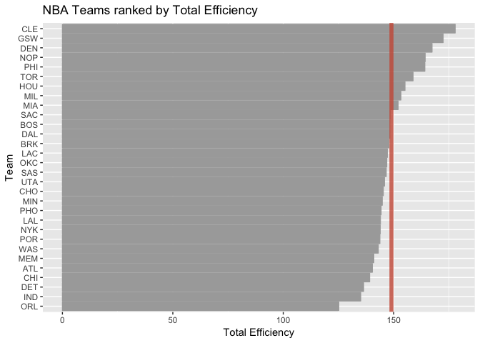

HW 03 - Ranking NBA Teams
================
Vitali Shypko
10/15/2017

### Ranking teams

#### Import the data

``` r
library(dplyr)
```

    ## 
    ## Attaching package: 'dplyr'

    ## The following objects are masked from 'package:stats':
    ## 
    ##     filter, lag

    ## The following objects are masked from 'package:base':
    ## 
    ##     intersect, setdiff, setequal, union

``` r
library(ggplot2)
library(readr)
```

``` r
teams <- read_csv('../data/nba2017-teams.csv')
```

    ## Parsed with column specification:
    ## cols(
    ##   team = col_character(),
    ##   experience = col_integer(),
    ##   salary = col_double(),
    ##   points3 = col_integer(),
    ##   points2 = col_integer(),
    ##   free_throws = col_integer(),
    ##   points = col_integer(),
    ##   off_rebounds = col_integer(),
    ##   def_rebounds = col_integer(),
    ##   assists = col_integer(),
    ##   steals = col_integer(),
    ##   blocks = col_integer(),
    ##   turnovers = col_integer(),
    ##   fouls = col_integer(),
    ##   efficiency = col_double()
    ## )

``` r
teams <- arrange(teams, desc(teams$salary))
```

#### Plots

``` r
# NBA Teams ranked by Total Salary
ggplot(teams, aes(x = reorder(team, salary), y = salary)) +
  geom_bar(stat = 'identity', fill = 'gray', colour = 'gray') +
  xlab('Team') +
  ylab('Salary (in millions)') +
  ggtitle('NBA Teams ranked by Total Salary') +
  geom_hline(aes(yintercept = mean(teams$salary)), colour = 'darksalmon', size = 2, alpha = 0.8) +
  coord_flip()
```


``` r
# NBA Teams ranked by Total Points
ggplot(teams, aes(x = reorder(team, points), y = points)) +
  geom_bar(stat = 'identity', fill = 'gray', colour = 'gray') +
  xlab('Team') +
  ylab('Total Points') +
  ggtitle('NBA Teams ranked by Total Points') +
  geom_hline(aes(yintercept = mean(teams$points)), colour = 'darksalmon', size = 2, alpha = 0.8) +
  coord_flip()
```


``` r
# NBA Teams ranked by Total Efficiency
ggplot(teams, aes(x = reorder(team, efficiency), y = efficiency)) +
  geom_bar(stat = 'identity', fill = 'gray', colour = 'gray') +
  xlab('Team') +
  ylab('Total Efficiency') +
  ggtitle('NBA Teams ranked by Total Efficiency') +
  geom_hline(aes(yintercept = mean(teams$efficiency)), colour = 'darksalmon', size = 2, alpha = 0.8) +
  coord_flip()
```



From these plots, we can see that there is a correlation between efficiency and total salary of a team. For example, CLE has the highest total salary and it's also the most efficient. For some other teams, however, the link between salary and efficiency is not so obvious. The correlation between total points and total efficiency if more evident. In fact, for most teams, their position in Total Points plot is +-4 their position in the Total Efficiency plot, which suggests that there is a strong link between points and efficiency.

### Principal Components Analysis (PCA)

``` r
points3 <- teams$points3
points2 <- teams$points2
free_throws <- teams$free_throws
off_rebounds <- teams$off_rebounds
def_rebounds <- teams$def_rebounds
assists <- teams$assists
steals <- teams$steals
blocks <- teams$blocks
turnovers <- teams$turnovers
fouls <- teams$fouls
team <- teams$team

pca_df <- data.frame(points3, points2, free_throws, off_rebounds, def_rebounds, assists,
                 steals, blocks, turnovers, fouls, stringsAsFactors = FALSE)
pca <- prcomp(pca_df, scale. = TRUE)
pca$team = team

eigenvalue = round(pca$sdev^2, 4)
prop = round(pca$sdev^2 / sum(pca$sdev^2), 4)
cumprop = round(cumsum(pca$sdev^2 / sum(pca$sdev^2)), 4)
eigenvalues <- data.frame(eigenvalue, prop, cumprop)
eigenvalues # data frame with the eigenvalues
```

    ##    eigenvalue   prop cumprop
    ## 1      4.6959 0.4696  0.4696
    ## 2      1.7020 0.1702  0.6398
    ## 3      0.9795 0.0980  0.7377
    ## 4      0.7717 0.0772  0.8149
    ## 5      0.5341 0.0534  0.8683
    ## 6      0.4780 0.0478  0.9161
    ## 7      0.3822 0.0382  0.9543
    ## 8      0.2603 0.0260  0.9804
    ## 9      0.1336 0.0134  0.9937
    ## 10     0.0627 0.0063  1.0000

``` r
PC1 = -pca$x[ , 1]
PC2 = -pca$x[ , 2]
PC = data.frame(PC1, PC2, team, stringsAsFactors = FALSE) # PC1, PC2, and corresponding teams.
PC1 = PC[ , 1]
PC2 = PC[ , 2]
```

``` r
# PCA plot (PC1 and PC2)
ggplot(PC, aes(x = PC1, y = PC2)) +
  xlab('PC1') +
  ylab('PC2') +
  ggtitle('PCA plot (PC1 and PC2)') +
  geom_text(aes(label = team)) +
  geom_hline(yintercept = 0, colour = 'darkgray', size = 1) +
  geom_vline(xintercept = 0, colour = 'darkgray', size = 1) +
  scale_y_reverse()
```


#### Index based on PC1

``` r
# Transformed score
s1 = 100 * ((PC1 - min(PC1)) / (max(PC1) - min(PC1)))
```

``` r
# NBA Teams ranked by Total Salary
ggplot(PC, aes(x = reorder(team, s1), y = s1)) +
  geom_bar(stat = 'identity', fill = 'gray', colour = 'gray') +
  xlab('Team') +
  ylab('First PC (scaled from 0 to 100)') +
  ggtitle('NBA Teams ranked by scaled PC1') +
  coord_flip()
```


### Comments and Reflections

Reflect on what was hard/easy, problems you solved, helpful tutorials you read, etc.

-   Was this your first time working on a project with such file structure? If yes, how do you feel about it?

> It was my first project with such file structure. However, in software engineering projects (especially web) I worked on there was a similar project structure, so I am not entirely new to it. I like when things are organized.

-   Was this your first time using relative paths? If yes, can you tell why they are important for reproducibility purposes?

> This was not my first time using relative paths. They are great because using them allows the project to work on multiple systems without the need to change paths.

-   Was this your first time using an R script? If yes, what do you think about just writing code?

> This was not my first time using R script. We used it in Lab 6.

-   What things were hard, even though you saw them in class/lab?

> Finding PC values and their meaning was challenging to me.

-   What was easy(-ish) even though we haven’t done it in class/lab?

> Drawing horizontal lines on ggplot was pretty straightforward.

-   Did anyone help you completing the assignment? If so, who?

> No one helped me, I completed the assignment by myself.

-   How much time did it take to complete this HW?

> It took me about 8 hours to complete this HW.

-   What was the most time consuming part?

> Making graphs exactly the way they looks like in the instructions was time consuming as well as PCA part. I couldn't draw the last graph with transformed score s1 for quite a while (the reason was that I stored PC1 in the dataframe with incorect sign).

-   Was there anything interesting?

> Everything was interesting. This homework was definitely the most challenging so far, but it also showed that we already can manipulate data and get the information we need from it.
