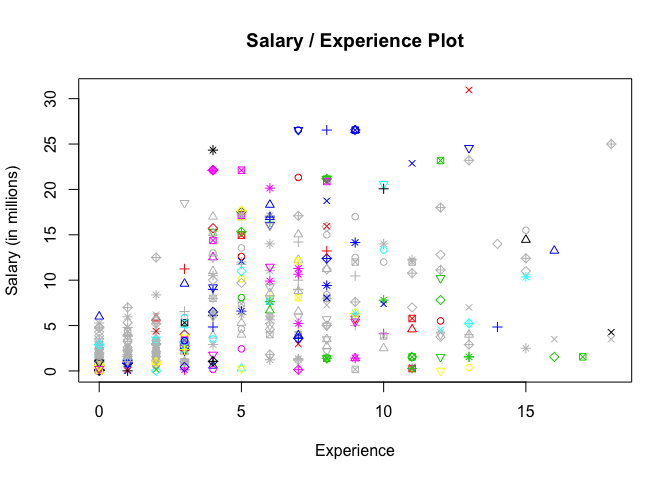

Post 1: SQL vs. R (dplyr): similarities and differences
================
Vitali Shypko
10/30/2017

As a Computer Science student with no prior experience in Statistics, I was not sure what to expect from the Statistics class. After a couple of lectures, I found out that we will learn R, which was also a completely new language to me. However, after doing a couple of labs and homeworks, it became evident that the things I am doing with R are very similar to the functionality of Structured Query Language (SQL) that is widely used for relational database management and software development in general (and that I am familiar with). After I realized that SQL is similar to R (especially to dplyr package), it became easier for me to understand what we are doing in the labs and how to make my R programs work as well as gave me better intuition in the class in general. This post is my attempt to shed the light on SQL for the students who are not familiar with the language and show the similarities and differences between SQL and R for students that know at least the basics of both languages.

------------------------------------------------------------------------

For the demonstrations of differences and similarities between dplyr and SQL, I will use R package called [SQLdf](https://cran.r-project.org/web/packages/sqldf/index.html). Let's prepare R Studio to run some experiments: First, create a new R Markdown project and install *sqldf* package with the following line of code:

``` r
install.packages("sqldf")
```

After the package is installed, let's [download](https://raw.githubusercontent.com/ucb-stat133/stat133-fall-2017/master/data/nba2017-roster.csv) the familiar NBA players data from the course github repository and put it into data folder of our new project. After that, we can use the `read.csv` function as always to load the .csv file and assign its data to a data frame players.

``` r
library(dplyr, warn.conflicts = FALSE, quietly = TRUE)
library(sqldf, warn.conflicts = FALSE, quietly = TRUE)
```

    ## Could not load tcltk.  Will use slower R code instead.

``` r
players <- read.csv('data/nba2017-roster.csv', stringsAsFactors = FALSE)
```

We will go over all the major dplyr functions and their analogs in SQL. Just as a reminder, the dplyr's grammar consists of the following verbs:

-   filter()
-   select()
-   slice()
-   arrange()
-   mutate()
-   group\_by()
-   summarise()

------------------------------------------------------------------------

#### Filter

To start, let's compare two analogous ways to retrieve the information about Golden State Warriors players with more than 10 years of NBA experience using SQL and dplyr code:

``` r
# dplyr code
players %>%
  filter(team == 'GSW' & experience > 10)
```

                player team position height weight age experience   salary
    1   Andre Iguodala  GSW       SF     78    215  33         12 11131368
    2       David West  GSW        C     81    250  36         13  1551659
    3      Matt Barnes  GSW       SF     79    226  36         13   383351
    4 Shaun Livingston  GSW       PG     79    192  31         11  5782450
    5    Zaza Pachulia  GSW        C     83    270  32         13  2898000

``` r
# SQL code
sqldf("SELECT *
      FROM players
      WHERE team = 'GSW'
      AND experience > 10;")
```

                player team position height weight age experience   salary
    1   Andre Iguodala  GSW       SF     78    215  33         12 11131368
    2       David West  GSW        C     81    250  36         13  1551659
    3      Matt Barnes  GSW       SF     79    226  36         13   383351
    4 Shaun Livingston  GSW       PG     79    192  31         11  5782450
    5    Zaza Pachulia  GSW        C     83    270  32         13  2898000

As we see, the results provided by these code chunks are the same. Let's go over the SQL syntax. The typical template for a simple SQL query that corresponds to the filter function in dplyr is `SELECT columns FROM source WHERE condition1 AND condition2`. This template allows us to filter data (using dplyr terms) from a data frame. Notice that to replicate the `filter()` function's behavior, we put '\*' after `SELECT`, which tells R Studio that we want to query all the columns from the table.

------------------------------------------------------------------------

#### Select

Since we usually want only specific columns from the table that satisfy provided conditions, let's go over `select()` function and it's analog in SQL. Say, we want to display *player name*, *team*, and *age* of the GSW players with more than 10 years of *experience*. We can do so using the following code:

``` r
# dplyr code
players %>%
  filter(team == 'GSW' & experience > 10) %>%
  select(player, team, age)
```

                player team age
    1   Andre Iguodala  GSW  33
    2       David West  GSW  36
    3      Matt Barnes  GSW  36
    4 Shaun Livingston  GSW  31
    5    Zaza Pachulia  GSW  32

``` r
# SQL code
sqldf("SELECT player, team, age
      FROM players
      WHERE team = 'GSW'
      AND experience > 10;")
```

                player team age
    1   Andre Iguodala  GSW  33
    2       David West  GSW  36
    3      Matt Barnes  GSW  36
    4 Shaun Livingston  GSW  31
    5    Zaza Pachulia  GSW  32

Here, we see that adding a select statement with the column names that we need has the same functionality as specifying the column names in `SELECT` statement in SQL.

------------------------------------------------------------------------

#### Slice

Sometimes, we don't need all the rows from the table resulting after we ran a filtering query on it. For that purpose, there is a `slice()` function in dplyr. As you probably have guessed, there is a way to run a SQL query to achieve the same results. Let's take a look only at the first 3 rows of the previous query:

``` r
# dplyr code
players %>%
  filter(team == 'GSW' & experience > 10) %>%
  select(player, team, age) %>%
  slice(1:3)
```

    # A tibble: 3 x 3
              player  team   age
               <chr> <chr> <int>
    1 Andre Iguodala   GSW    33
    2     David West   GSW    36
    3    Matt Barnes   GSW    36

``` r
# SQL code
sqldf("SELECT player, team, age
      FROM players
      WHERE team = 'GSW'
      AND experience > 10
      LIMIT 3;")
```

              player team age
    1 Andre Iguodala  GSW  33
    2     David West  GSW  36
    3    Matt Barnes  GSW  36

This is where the first noticeable difference between dplyr and SQL shows up. Using `slice()` function, we can provide values that are in the middle of the data table (such as 2:3 for rows 2 and 3), whereas in SQL we can only `LIMIT` the values displayed from the top of the table, so dplyr provides more flexibility in this specific case.

------------------------------------------------------------------------

#### Arrange

If we want data to be displayed in a particular order, in dplyr we use function `arrange()`. For the same purpose, there is an `ORDER BY` clause in SQL. Let's see an example of ordering GSW players with more than 10 years of *experience* in ascending order of their *age* and showing the first 4 results:

``` r
# dplyr code
players %>%
  filter(team == 'GSW' & experience > 10) %>%
  select(player, team, age) %>%
  arrange(age) %>%
  slice(1:4)
```

    # A tibble: 4 x 3
                player  team   age
                 <chr> <chr> <int>
    1 Shaun Livingston   GSW    31
    2    Zaza Pachulia   GSW    32
    3   Andre Iguodala   GSW    33
    4       David West   GSW    36

``` r
# SQL code
sqldf("SELECT player, team, age
      FROM players
      WHERE team = 'GSW'
      AND experience > 10
      ORDER BY age
      LIMIT 4;")
```

                player team age
    1 Shaun Livingston  GSW  31
    2    Zaza Pachulia  GSW  32
    3   Andre Iguodala  GSW  33
    4       David West  GSW  36

------------------------------------------------------------------------

#### Mutate

There are cases where we want to either rename an existing column in the table or make a new column with new data and specify its name. In dplyr, for this purpose, we use `mutate()`. In SQL, we can provide columns that we want to modify right into the `SELECT` clause. Let's display GSW players with a new column - *experience to salary in millions* ratio.

``` r
# dplyr code
players %>%
  filter(team == 'GSW') %>%
  mutate(exp_salary = round((experience / salary * 1000000), 2)) %>%
  select(player, team, exp_salary) %>%
  arrange(desc(exp_salary)) %>%
  slice(1:5)
```

    # A tibble: 5 x 3
             player  team exp_salary
              <chr> <chr>      <dbl>
    1   Matt Barnes   GSW      33.91
    2    David West   GSW       8.38
    3  JaVale McGee   GSW       5.70
    4 Zaza Pachulia   GSW       4.49
    5     Ian Clark   GSW       2.95

``` r
# SQL code
sqldf("SELECT player, team, ROUND((experience / salary * 1000000), 2) as exp_salary
      FROM players
      WHERE team = 'GSW'
      ORDER BY exp_salary desc
      LIMIT 5;")
```

             player team exp_salary
    1   Matt Barnes  GSW      33.91
    2    David West  GSW       8.38
    3  JaVale McGee  GSW       5.70
    4 Zaza Pachulia  GSW       4.49
    5     Ian Clark  GSW       2.95

Notice that in both dplyr and SQL we have a function `round` that rounds a number to the specified number of decimal places. Also, note that in both dplyr and SQL there is a desc parameter in arrange and `ORDER BY` clause respectively, which allows us to order data in descending order.

------------------------------------------------------------------------

#### Group by and Summarise

Other useful features of dplyr include grouping data by columns and aggregate data using `summarise()`. This is one of the cases where SQL provides a clause with the same name -- `GROUP BY`. However, there is no direct analog to `summarise()` function in SQL, but we can achieve the same result using the analog of `mutate()` -- specifying the data we want to aggregate in `SELECT` clause.

``` r
# dplyr code
summarise(
  group_by(players, position),
  sum_age = sum(age),
  avg_salary = mean(salary)
)
```

    # A tibble: 5 x 3
      position sum_age avg_salary
         <chr>   <int>      <dbl>
    1        C    2308    6987682
    2       PF    2308    5890363
    3       PG    2243    6069029
    4       SF    2247    6513374
    5       SG    2489    5535260

``` r
# SQL code
sqldf("SELECT position, sum(age) as sum_age, avg(salary) as avg_salary
      FROM players
      GROUP BY position;")
```

      position sum_age avg_salary
    1        C    2308    6987682
    2       PF    2308    5890363
    3       PG    2243    6069029
    4       SF    2247    6513374
    5       SG    2489    5535260

Note that SQL uses avg function instead of mean that is used by dplyr.

------------------------------------------------------------------------

With this brief overview of SQL features compared to dplyr functionality, it seems like for the most part these languages can be interchangeable when our main goal is to query data. However, the differences become apparent when we want to actually analyze data. This is where dplyr, and R in general, is taking the lead. One of the features of R that can't be done using raw SQL is drawing graphs like this:

``` r
plot(players$experience, round((players$salary / 1000000), 2), 
     col = players$salary, pch = 1:9, cex = 0.9,
     xlab = "Experience", ylab = "Salary (in millions)", 
     main = "Salary / Experience Plot")
```



On the other hand, SQL is much wider used in software development industry that relies heavily on relational databases and is not that dependent on the statistical part of data. In everyday life of a software developer, writing SQL queries doesn't require any additional software -- it's fully supported through Terminal or its analogs, which is very useful and saves time.

As with many other things that are used to achieve similar goals, it is up to the professional to choose the suitable tool to perform a specific task. Hopefully, from this brief overview the connection between dplyr and SQL became more evident for people familiar with both languages. For those who have not seen SQL before, this article should give an overview of the features of SQL. With your knowledge or R, it should be much easier to pick up SQL syntax should you decide to go into software engineering or database management.

For those of you, who became interested in learning SQL after reading this post, I strongly suggest taking this free [Khan Academy intro course](https://www.khanacademy.org/computing/computer-programming/sql).

------------------------------------------------------------------------

#### References:

-   <https://blog.exploratory.io/why-sql-is-not-for-analysis-but-dplyr-is-5e180fef6aa7>
-   <http://dplyr.tidyverse.org/>
-   <https://blog.rstudio.com/2017/06/13/dplyr-0-7-0/>
-   <http://www.datacarpentry.org/R-ecology-lesson/05-r-and-databases.html>
-   <http://datascience.la/dplyr-some-more-reflections/>
-   <https://sqlite.org/docs.html>
-   <http://blog.yhat.com/posts/10-R-packages-I-wish-I-knew-about-earlier.html>
-   <https://cran.r-project.org/web/packages/sqldf/index.html>
-   <https://raw.githubusercontent.com/ucb-stat133/stat133-fall-2017/master/data/nba2017-roster.csv>
