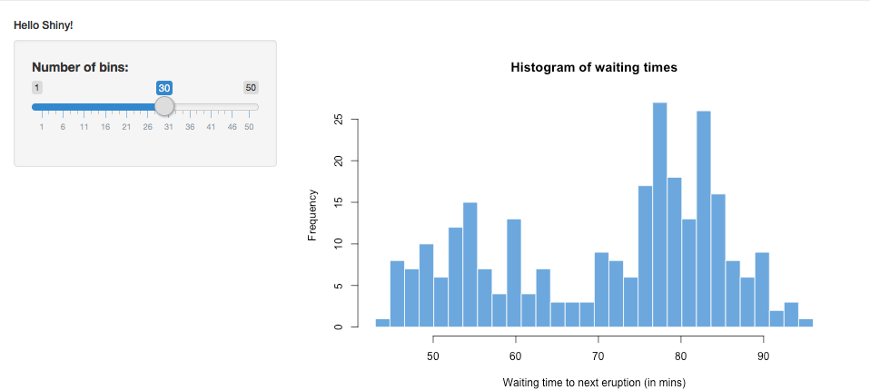

```{r setup, include=FALSE}
knitr::opts_chunk$set(echo = TRUE)
```

---

#### Introduction
After months spent coding in R, we learned a lot about different aspects of data preparation and manipulation, but we could not really show or share what we have learned with the outside world easily. If we wanted to ask for an opinion on our work, there was no easy way to get it. Luckily, we recently learned about Shiny Apps -- the simple way to build your own web app using RStudio. Shiny Apps allow to visualize our applications written in R and they provide tools for manipulating the data. For example, a user can change some value in R, and the application will recalculate the output based on the new value and update itself instantly.

---

#### Motivation and background
Knowing Shiny Apps provides us with an ability to share our apps with people all over the world. At this point, not only the functionality of the app matters but its aesthetic qualities as well. No matter how functional your app is, people will not use it if it has a poorly designed User Interface. Therefore, it is crucial to make the app look attractive. For that reason, we can use tools that are very popular in web-development -- HyperText Markup Language (HTML) and Cascading Style Sheets (CSS). These tools help web developers structure static content of web applications and style them. These same tools are used under the hood of our Shiny apps!

---

#### Examples
In order to learn how to modify the style of our Shiny Apps, let's first make sure that we have the Shiny package installed. For that, run the following command in your RStudio console:
```
install.packages("shiny")
```
For this lesson, let's use app code that is provided by Shiny. For that, after the successful installation of Shiny package, run
```
runExample("01_hello")
```
in the RStudio console. You should see something like this:

After that, create a new directory for your future Shiny App, copy the code from app.R displayed on the screenshot to app.R in your app folder. Then run app.R in RStudio and make sure that you see the same histogram. If you open app.R, you will see a familiar code and layout. Let's see how we can modify the output using HTML. HTML uses __tags__ to mark different things on the page. In R, there is a list of objects __tags__ that consists of all the HTML tags supported, which is very useful. We can basically write HTML code using RStudio. To try it out, let's start with the basics. The current title we have is "Hello Shiny!" Let's play with its size. There are specific tags in HTML created for headings. __h1__ through __h6__, where the smaller the number next to __h__ is, the bigger the heading's size is. Let's see compare the output of our app with two different heading sizes. First, change line 7 from
```
titlePanel("Hello Shiny!"),
```
to 
```
titlePanel(tags$h1("Hello Shiny!")),
```
to get the biggest heading size in HTML. After that, change that same line to
```
titlePanel(tags$h6("Hello Shiny!")),
```
Compare the results:


It worked! Great start. Now let's learn more tags.
Some of the basic ones for text manipulating are: __strong__ - to make text bold, __em__ to emphasize text (make it italic), and __u__ to underline the text. If you insert the following line into line 8 of the app.R
```
"This is a test of text manipulating HTML tags",
```
and run the app, you should see new text under the "Hello Shiny!" heading. Now let's apply our newly learned tags to that text. Change the line to
```
tags$strong("This"), "is a test of", tags$u("text"),
tags$em("manipulating"), "HTML tags",
```
You should see that "This" is bold, "text" is underlined and "manipulating" is italicized. We can also have nested tags. For example, we can put all the tags we just learned inside of a parent tag __p__, which is used for paragraphs.
```
tags$p(tags$strong("This"), "is a test of", tags$u("text")),
tags$p(tags$em("manipulating"), "HTML tags"),
```
Now you should see that our previous output is divided into two paragraphs.

With this basic knowledge of HTML, we can start discovering CSS. CSS is mostly used to modify the existing HTML elements. It is a good practice to have a separate CSS file and connect it, but in this tutorial, we will omit it and use CSS in app.R. In order to have a better understanding of what we will do next, let's take a look at the most basic HTML page template.


We can ignore the first line for now. We see that the main tag is __html__, and then __head__ and __body__ divide the page into two parts. Since we are not using a separate CSS file, we need to familiarize ourselves with __style__ tag, which allows writing inline CSS right in the app.R. Now insert the following chunk of code in line 6 and run your app.
```
    tags$style(HTML("
                    body {
                      background-color: #ab1d39;
                    }
                    h1 {
                      text-align: center;
                      color: lightgray;
                      border: 1px solid red;
                    }
                    p {
                      text-align: center;
                      color: white;
                      font-size: 18px;
                    }
                    strong {
                      color: yellow;
                    }
                    u {
                      color: lightblue;
                    }
                    em {
                      color: darkgray;
                      text-decoration: line-through;
                    }
                    ")
    ),
```
You should see a primitively styled version of the app that looks like this:

Not bad for the first time. Now let's see what exactly our code did. Notice that inside of __tags$style__ we put all the tags that we introduced before. __body__ tag is responsible for most of the elements on the page. Therefore, if we apply any rules to that tag, most likely those rules will be applied to all the elements within the __body__. In our case, we tell CSS that we want the background color of our page to be reddish (#ab1d39). __h1__ is the tag for our heading. We tell the __h1__ element to be centered, with lightgray color and a 1px border that is solid and of red color. __p__ is again a tag that includes other tags inside it. Therefore, the rules applied to it will be applied to all its children. We tell p and all its children to be centered, have a white color of the font, and be 18px big. Even though __strong__, __u__, and __em__ tags are within p tags and are their children, we can still apply styling to them. There is a rule in CSS that it will apply the style that is the most specific to the element. So, for example, currently all the elements within __p__ are white, but in __strong__ we say the font to be yellow. By doing so, we overwrite the instructions provided in __p__ and CSS will select the most specific rule, which is that color should be yellow. Similarly, we apply lightblue font color to __u__. In __em__ besides overwriting the font color, we apply a text decoration, which says that we want to have a line through the __em__ element.

___

#### Discussion
As we see, it took us very little time to make stylize our app, but we barely scratched the surface of all the possibilities HTML and CSS provide. Learning these tools takes some time, but they are really beginners-friendly. As you already noticed, a lot of tags in HTML and rules in CSS are in plain English, which makes it much more intuitive to use them. Knowing how to make your Shiny App look beautiful is a great way to stand out among other apps. Hopefully, this tutorial will help you to make your apps not only functional but also aesthetically pleasing.

___

#### Conclusions
HTML and CSS are very useful tools and are not hard to learn. They are the backbone of the vast majority of web-pages. If you are interested in design, web development, product, or anything else related to visuals, HTML and CSS are a must skill. If you are interested to learn more about the possibilities of them, these are some great places for beginners to start digging deeper: 
[HTML](http://www.htmldog.com/guides/html/beginner/ "HTML") and [CSS](http://www.htmldog.com/guides/css/beginner/ "CSS").

___

#### References:
* https://rstudio.github.io/shiny/tutorial/#hello-shiny
* https://rstudio.github.io/shiny/tutorial/#html-ui
* https://shiny.rstudio.com/articles/css.html
* https://www.w3.org/Style/CSS/Overview.en.html
* https://www.w3.org/TR/html/
* https://www.w3schools.com/TAGs/
* http://htmldog.com/references/html/tags/
* http://helmswebsites.com/Web_Design_Under_the_hood/images/htmlpagelayout217w159h.gif
