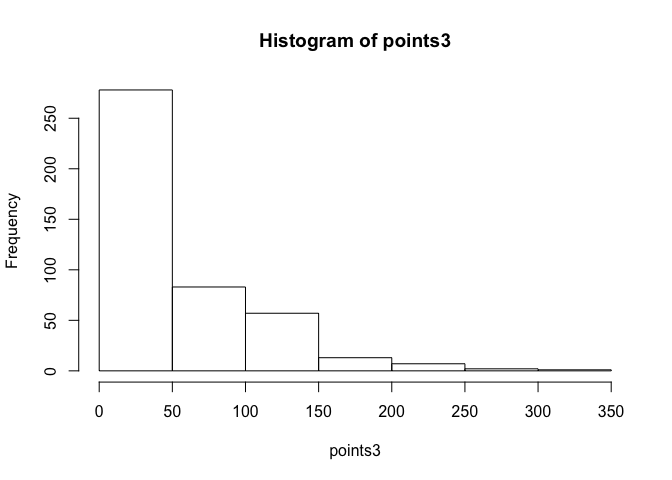
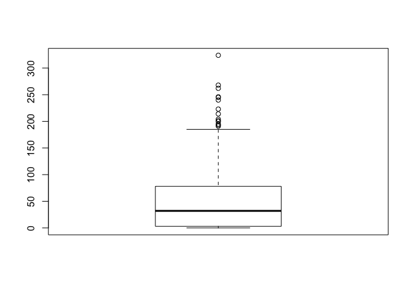
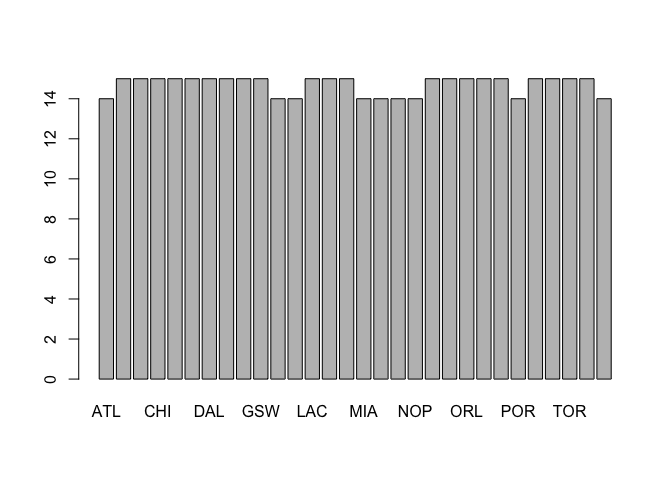

Warm-Up 02 - Stat 133, Fall 2017
================
Vitali Shypko
9/11/2017

**Loading resources**:

``` r
# load the objects
load('nba2017-salary-points.RData')
```

``` r
# list the available objects
ls()
```

    ## [1] "experience" "player"     "points"     "points1"    "points2"   
    ## [6] "points3"    "position"   "salary"     "team"

All the objects described in the data directory are present (*"experience"*, *"player"*, *"points"*, *"points1"*, *"points2"*, *"points3"*, *"position"*, *"salary"*, *"team"*)

------------------------------------------------------------------------

**Classes of objects in the file**:

``` r
class(experience)
```

    ## [1] "character"

``` r
class(player)
```

    ## [1] "character"

``` r
class(points)
```

    ## [1] "integer"

``` r
class(points1)
```

    ## [1] "integer"

``` r
class(points2)
```

    ## [1] "integer"

``` r
class(points3)
```

    ## [1] "integer"

``` r
class(position)
```

    ## [1] "character"

``` r
class(salary)
```

    ## [1] "numeric"

``` r
class(team)
```

    ## [1] "factor"

**There are no lists, but there are vectors and a factor**.

------------------------------------------------------------------------

**Object modes**:

``` r
mode(experience)
```

    ## [1] "character"

``` r
mode(player)
```

    ## [1] "character"

``` r
mode(points)
```

    ## [1] "numeric"

``` r
mode(points1)
```

    ## [1] "numeric"

``` r
mode(points2)
```

    ## [1] "numeric"

``` r
mode(points3)
```

    ## [1] "numeric"

``` r
mode(position)
```

    ## [1] "character"

``` r
mode(salary)
```

    ## [1] "numeric"

``` r
mode(team)
```

    ## [1] "numeric"

------------------------------------------------------------------------

**Length of all the objects**:

``` r
length(experience)
```

    ## [1] 441

``` r
length(player)
```

    ## [1] 441

``` r
length(points)
```

    ## [1] 441

``` r
length(points1)
```

    ## [1] 441

``` r
length(points2)
```

    ## [1] 441

``` r
length(points3)
```

    ## [1] 441

``` r
length(position)
```

    ## [1] 441

``` r
length(salary)
```

    ## [1] 441

``` r
length(team)
```

    ## [1] 441

------------------------------------------------------------------------

Exploratory Data Analysis
-------------------------

------------------------------------------------------------------------

### Quantitative Variable

------------------------------------------------------------------------

**Summary**:

``` r
summary(points3)
```

    ##    Min. 1st Qu.  Median    Mean 3rd Qu.    Max. 
    ##    0.00    3.00   32.00   49.71   78.00  324.00

------------------------------------------------------------------------

**Statistics**:

-   *Mean (i.e. average)*:

``` r
mean(points3)
```

    ## [1] 49.70748

-   *Standard deviation*:

``` r
sd(points3)
```

    ## [1] 55.9721

-   *Minimum value*:

``` r
min(points3)
```

    ## [1] 0

-   *Maximum value*:

``` r
max(points3)
```

    ## [1] 324

-   *Median*:

``` r
median(points3)
```

    ## [1] 32

-   *Quartiles*:

``` r
quantile(points3)
```

    ##   0%  25%  50%  75% 100% 
    ##    0    3   32   78  324

**The typical values are ~50**.

------------------------------------------------------------------------

**The spread in each vector**:

``` r
range(points3)
```

    ## [1]   0 324

------------------------------------------------------------------------

**Distribution**:

``` r
hist(points3)
```



``` r
boxplot(points3)
```



------------------------------------------------------------------------

### Qualitative Variable (*team*)

------------------------------------------------------------------------

**Is the variable factor**?

``` r
is.factor(team)
```

    ## [1] TRUE

------------------------------------------------------------------------

**Frequency table (counts of each category)**:

``` r
table(team)
```

    ## team
    ## ATL BOS BRK CHI CHO CLE DAL DEN DET GSW HOU IND LAC LAL MEM MIA MIL MIN 
    ##  14  15  15  15  15  15  15  15  15  15  14  14  15  15  15  14  14  14 
    ## NOP NYK OKC ORL PHI PHO POR SAC SAS TOR UTA WAS 
    ##  14  15  15  15  15  15  14  15  15  15  15  14

------------------------------------------------------------------------

**Relative frequencies (proportions)**:

``` r
prop.table(table(team))
```

    ## team
    ##        ATL        BOS        BRK        CHI        CHO        CLE 
    ## 0.03174603 0.03401361 0.03401361 0.03401361 0.03401361 0.03401361 
    ##        DAL        DEN        DET        GSW        HOU        IND 
    ## 0.03401361 0.03401361 0.03401361 0.03401361 0.03174603 0.03174603 
    ##        LAC        LAL        MEM        MIA        MIL        MIN 
    ## 0.03401361 0.03401361 0.03401361 0.03174603 0.03174603 0.03174603 
    ##        NOP        NYK        OKC        ORL        PHI        PHO 
    ## 0.03174603 0.03401361 0.03401361 0.03401361 0.03401361 0.03401361 
    ##        POR        SAC        SAS        TOR        UTA        WAS 
    ## 0.03174603 0.03401361 0.03401361 0.03401361 0.03401361 0.03174603

**Looking at the frequencies and relative frequencies, it looks like the distribution is almost even**.

------------------------------------------------------------------------

**Frequencies with a barchart**:

``` r
barplot(table(team))
```



------------------------------------------------------------------------

### Process report

-   What things were hard, even though you saw them in class?

> Describing data and graphs is pretty hard for me as a non-stats major.

-   What was easy(-ish) even though we haven't done it in class?

> Markdown syntax and features (getting used to it). Also, using new libraries and functions is pretty straightworward in most cases.

-   What type of "errors" you struggled with (if any)?

> "Error: attempt to use zero-length variable name". But it seems to knit regardless of it.

-   What are the parts you are not fully understanding?

> I am not fully understanding how exactly we need to describe graphs and our findings.

-   What was the most time consuming part?

> The most time consuming part was using R functions that I haven't encountered before (such as density curve).

-   Did you collaborate with other students? If so, with who? In what manner?

> I didn't collaborate with other students.

-   Was there any frustrating issue? (e.g. RStudio cryptic error, one or more package not playing nice)

> In the very beginning, RStudio couldn't locate the data file. After I restarted it, the error was gone.
